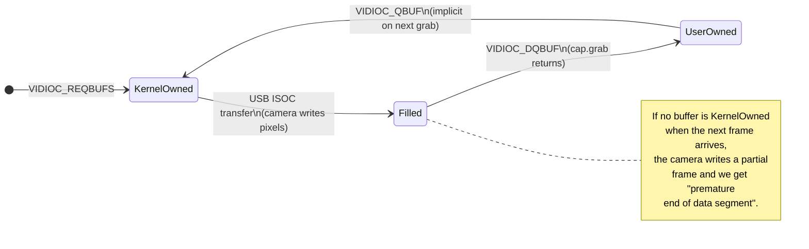
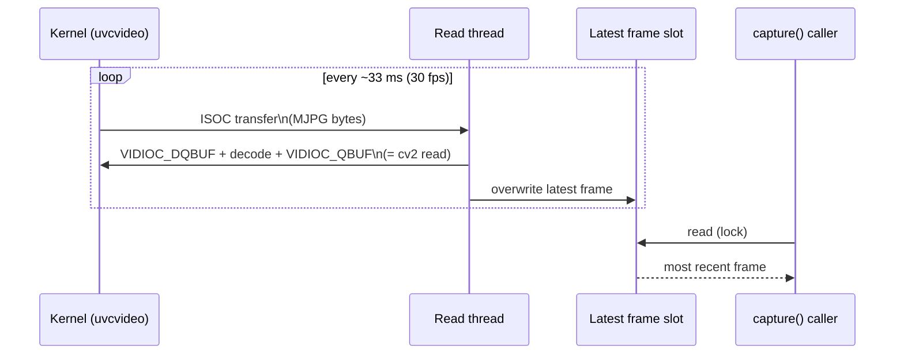

# Frame capture design

`UvcCamera` reads frames from a V4L2 device through OpenCV's `cv2.VideoCapture`.
On Linux + MJPG, naive usage causes either **3-5 second lag** (buffer accumulation)
or **JPEG corruption** (buffer starvation). This note explains why, and the
current background-reader design that avoids both.

## V4L2 ring buffer cycle

The kernel maintains a small pool of frame buffers (typically 4 slots on `uvcvideo`).
Each frame transitions through three states:

**Invariant**: there must always be at least one `KernelOwned` slot for the
camera to write into. Each `grab()` *dequeues* a slot, each `retrieve()` (or
the next `grab()`) *requeues* it. Skipping `retrieve()` over many `grab()`
calls leaves slots stuck in `UserOwned` → starvation → truncated frames.

## Why the naive designs fail

| Design | Latency | Correctness |
|---|---|---|
| `read()` on demand only | 3-5 s lag (buffer accumulates) | OK frames |
| `grab()` in background, `retrieve()` on demand | low | **truncated frames** under load |
| `read()` in background, expose latest frame | low | OK frames |

The middle design is what we tried first. It breaks because `grab()` alone
doesn't actually complete the queue cycle on the V4L2 backend — see
[OpenCV issue #23311](https://github.com/opencv/opencv/issues/23311).

## Current design

A daemon thread per camera runs a tight `read()` loop and publishes the
latest decoded frame into a slot protected by a lock. Callers of `capture()`
just read that slot.

**Trade-off**: the thread pays the MJPG decode cost continuously (~7-10 ms
per frame on RPi 4, ~18 % of one core at 30 fps per camera) even when no
one is calling `capture()`. This is the price of always returning a fresh
frame *and* keeping the buffer cycle correct.

If CPU becomes a problem with N cameras, the simplest knob is to lower the
capture FPS (`v4l2-ctl --set-parm=15`), which cuts the decode cost in half
without changing the architecture.

## References

- OpenCV issue [#23311](https://github.com/opencv/opencv/issues/23311) —
  V4L2 backend returns incomplete JPEG data when `grab()` is used without
  matching `retrieve()`.
- OpenCV issue [#9477](https://github.com/opencv/opencv/issues/9477) —
  "extraneous bytes before marker 0xd9" symptom of MJPG corruption.
- [`cv::VideoCapture` API reference](https://docs.opencv.org/4.x/d8/dfe/classcv_1_1VideoCapture.html)
  — `grab()` / `retrieve()` / `read()` semantics.
- Linux kernel
  [V4L2 streaming I/O](https://www.kernel.org/doc/html/latest/userspace-api/media/v4l/mmap.html)
  — `VIDIOC_QBUF` / `VIDIOC_DQBUF` queue contract.
