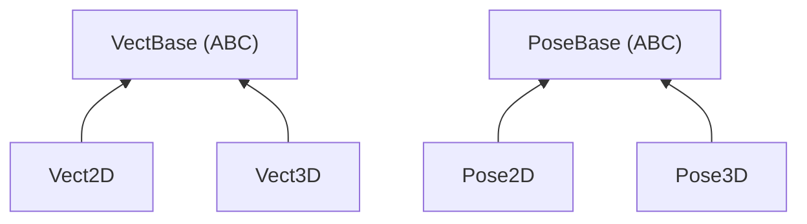

# Vector and Pose Types

## Overview

Four concrete types organized under two abstract bases:

`VectBase` types are true vectors: addition, subtraction, scaling, norm, and dot product are defined. `PoseBase` types represent a position plus an orientation (an element of the SE(2) or SE(3) group), these support coordinate-frame transforms but not vector arithmetic.

**Module**: `evo_lib.types.vect`

## Vect2D

`Vect2D(x, y)`: 2D position or displacement in millimeters.

**Operations**: `+`, `-`, `*scalar`, `-v` (negate), `norm()`, `sqr_norm()`, `normalized()`, `dot(other)`, `rotate(theta)`, `angle()`.

**Polar**: `Vect2D.from_polar(r, theta)` and `v.to_polar() → (r, theta)`. Useful for converting LiDAR measurements from polar to cartesian at read time.

**Utility**: `Vect2D.mean(points)` computes the centroid of a list of points. `v.offset_toward(target, distance)` offsets a target along the self→target line.

**Conversion**: `v.to_3d(z=0.0) → Vect3D`, `v.to_dict() → {"x": ..., "y": ...}`.

## Vect3D

`Vect3D(x, y, z)`: 3D position or displacement in millimeters.

Same arithmetic operations as Vect2D, plus `cross(other)`.

**Utility**: `Vect3D.mean(points)` computes the centroid of a list of 3D points.

**Conversion**: `v.to_2d() → Vect2D` (projects onto XY, Z is discarded), `v.to_dict()`.

## Pose2D

`Pose2D(x, y, theta=0.0)`: 2D pose (position + heading). The main type for ground robot operations.

**`transform(point: Vect2D) → Vect2D`**: converts a point from this frame into the parent frame. Replaces the legacy `change_referencial(p, theta)`.

**`inverse() → Pose2D`**: the inverse transform (parent → local).

**`compose(other: Pose2D) → Pose2D`**: chains two transforms (self then other in self's local frame).

**`position → Vect2D`**: the translation part.

**`from_dict(d) → Pose2D`**: builds from a config dict (e.g. `{"x": 0, "y": 85, "theta": 0}`).

**Conversion**: `to_3d(z=0.0) → Pose3D`, `to_dict()`.

## Pose3D

`Pose3D(x, y, z, roll=0.0, pitch=0.0, yaw=0.0)`: full 6-DOF pose for articulated arms or 3D sensors.

Same interface as Pose2D (`transform`, `inverse`, `compose`, `position`, `from_dict`), operating on `Vect3D` points.

**Quaternion storage**: orientation is stored internally as a unit quaternion, avoiding gimbal lock. The constructor accepts Euler angles for convenience, converting them to a quaternion. Access the quaternion directly via `qw`, `qx`, `qy`, `qz` properties or `quaternion → (w, x, y, z)`. Euler angles are available as computed properties (`roll`, `pitch`, `yaw`).

**`from_quaternion(x, y, z, qw, qx, qy, qz) → Pose3D`**: constructs directly from a unit quaternion without Euler conversion.

**Conversion**: `to_2d() → Pose2D` (Z, roll, pitch discarded, yaw becomes theta), `to_dict()` (serializes with Euler angles for human readability).

## Design rationale

### Why no inheritance between Vect2D and Vect3D

`Vect3D` is not a `Vect2D`. If it inherited from it, a `Vect3D` could silently be used wherever a `Vect2D` is expected, discarding Z without warning. Conversions are explicit (`to_2d()`, `to_3d()`) so the developer consciously chooses to gain or lose a dimension.

### Why PoseBase is separate from VectBase

`(x, y, theta)` is not a vector in the mathematical sense: `norm(x, y, theta)` would mix millimeters and radians. Pose types are elements of the SE(n) group (rigid body transforms), not of a vector space. Keeping them separate prevents nonsensical operations like adding two poses.

### Why quaternions for Pose3D

Euler angles suffer from gimbal lock: when pitch reaches ±90°, roll and yaw become indistinguishable, losing one degree of freedom. Quaternions have no singularities and compose more efficiently (one multiplication instead of building/decomposing rotation matrices). The config files still use Euler angles (human-readable), conversion happens at load time.

### Locatable components

Some components need a physical position and orientation on the robot for their data to be usable (e.g. a LiDAR's scan must be transformed from sensor frame to robot frame). This is not an intrinsic property of a component type, it's opt-in, activated per instance in the config via an optional `pose` field that deserializes into a `Pose2D` or `Pose3D`. See [the locatable components proposal](locatable-components.md) for details.
