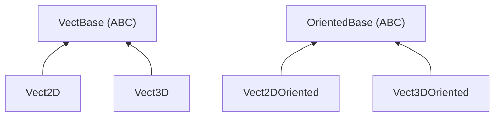

# Vector Types

## Overview

Four vector types organized under two abstract bases:

`VectBase` types are true vectors: addition, subtraction, scaling, norm, and dot product are defined. `OrientedBase` types represent a position plus an orientation (an element of the SE(2) or SE(3) group), these support coordinate-frame transforms but not vector arithmetic.

**Module**: `evo_lib.types.vect`

## Vect2D

`Vect2D(x, y)`: 2D position or displacement in millimeters.

**Operations**: `+`, `-`, `*scalar`, `-v` (negate), `norm()`, `normalized()`, `dot(other)`, `rotate(theta)`, `angle()`.

**Polar**: `Vect2D.from_polar(r, theta)` and `v.to_polar() → (r, theta)`. Useful for converting LiDAR measurements from polar to cartesian at read time.

**Conversion**: `v.to_3d(z=0.0) → Vect3D`.

## Vect3D

`Vect3D(x, y, z)`: 3D position or displacement in millimeters.

Same arithmetic operations as Vect2D, plus `cross(other)`.

**Conversion**: `v.to_2d() → Vect2D` (projects onto XY, Z is discarded).

## Vect2DOriented

`Vect2DOriented(x, y, theta=0.0)`: 2D pose (position + heading). The main type for ground robot operations.

**`transform(point: Vect2D) → Vect2D`**: converts a point from this frame into the parent frame. Replaces the legacy `change_referencial(p, theta)`.

**`inverse() → Vect2DOriented`**: the inverse transform (parent → local).

**`compose(other: Vect2DOriented) → Vect2DOriented`**: chains two transforms (self then other in self's local frame).

**`position → Vect2D`**: the translation part.

**`from_dict(d) → Vect2DOriented`**: builds from a config dict (e.g. `{"x": 0, "y": 85, "theta": 0}`).

**Conversion**: `to_3d_oriented(z=0.0) → Vect3DOriented`.

## Vect3DOriented

`Vect3DOriented(x, y, z, roll=0.0, pitch=0.0, yaw=0.0)`: full 6-DOF pose for articulated arms or 3D sensors.

Same interface as Vect2DOriented (`transform`, `inverse`, `position`, `from_dict`), operating on `Vect3D` points. Rotation uses ZYX intrinsic convention (yaw applied first, then pitch, then roll).

**Conversion**: `to_2d_oriented() → Vect2DOriented` (Z, roll, pitch discarded, yaw becomes theta).

## Design rationale

### Why no inheritance between Vect2D and Vect3D

`Vect3D` is not a `Vect2D`. If it inherited from it, a `Vect3D` could silently be used wherever a `Vect2D` is expected, discarding Z without warning. Conversions are explicit (`to_2d()`, `to_3d()`) so the developer consciously chooses to gain or lose a dimension.

### Why OrientedBase is separate from VectBase

`(x, y, theta)` is not a vector in the mathematical sense: `norm(x, y, theta)` would mix millimeters and radians. Oriented types are elements of the SE(n) group (rigid body transforms), not of a vector space. Keeping them separate prevents nonsensical operations like adding two poses.

### Locatable components

Some components need a physical position and orientation on the robot for their data to be usable (e.g. a LiDAR's scan must be transformed from sensor frame to robot frame). This is not an intrinsic property of a component type, it's opt-in, activated per instance in the config via an optional `pose` field that deserializes into a `Vect2DOriented` or `Vect3DOriented`. See [the locatable components proposal](locatable-components.md) for details.
